# MassLab — виртуальная лабораторная работа «Времяпролётный масс-спектрометр»

Настольное приложение для курса «Физика ядра» (3 курс, физика и смежные
специальности). Студенты знакомятся с принципом действия времяпролётного
(TOF) масс-спектрометра: проходят входной тест, выполняют три задания на
виртуальном приборе и сохраняют отчёт для преподавателя.

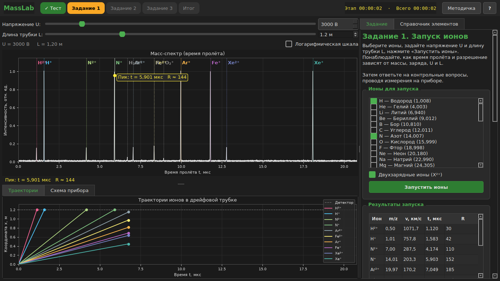

---

## 1. Цели и требования

| Требование | Как реализовано |
|---|---|
| Ознакомление с принципом TOF | Интерактивный прибор: спектр, траектории, анимированная схема, методичка |
| Допуск к работе | Входной тест: 10 случайных вопросов из банка (30+), зачёт от 9/10, пересдача с новыми вопросами |
| Три задания | 1 — запуск ионов и контрольные вопросы, 2 — неизвестный элемент, 3 — состав сплава |
| Время ~30 мин без теста | Задания подобраны по объёму; время каждого этапа фиксируется |
| Работа в паре | Входит один студент (ФИО и группа) |
| Отчёт преподавателю | PDF: ФИО, группа, работа, сводка, по каждому заданию — график и данные |
| Никаких собранных данных | Программа ничего не пишет на диск; PDF — только по кнопке студента |
| Старые компьютеры | Windows 7 (Python 3.8 + PySide2) и Windows 10/11; экран от 1024×768 |
| Демонстрация на лекции | Скрытый режим песочницы по паролю |
| Обратная связь для диплома | QR-код анонимной Google-формы на итоговом экране |

---

## 2. Сценарий работы студента

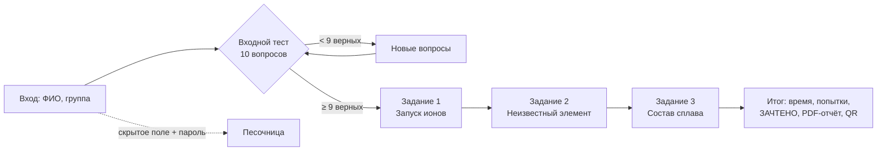

| Экран | Что делает студент |
|---|---|
| 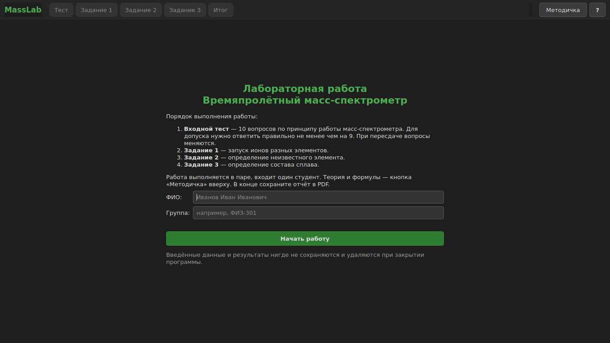 | **Вход.** ФИО и группа живут только в памяти до закрытия программы. В правом нижнем углу — невидимое поле пароля песочницы. |
| 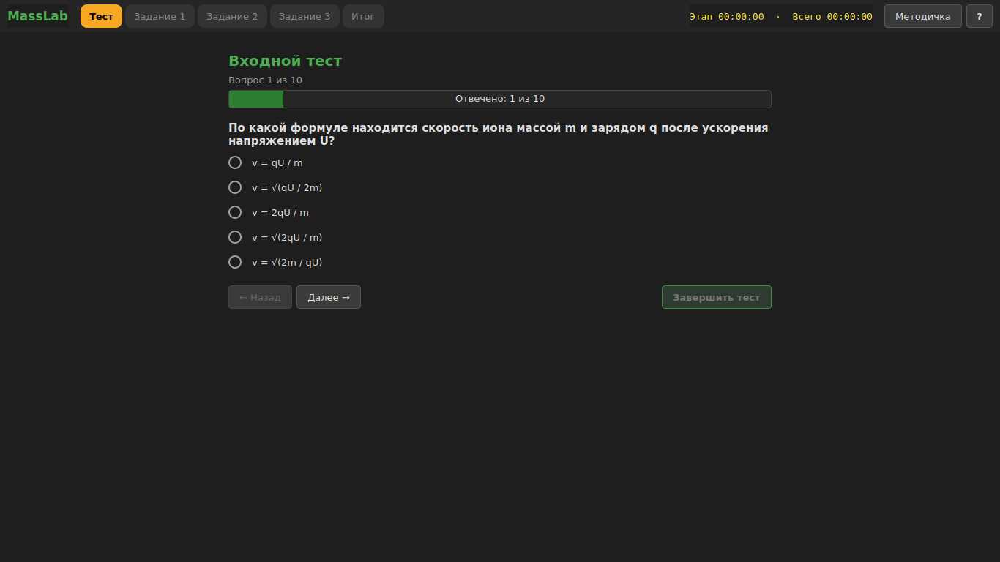 | **Входной тест.** Варианты (4–6) перемешиваются, можно возвращаться к вопросам. При неудаче показываются вопросы с ошибками, затем выдаётся новый набор. Методичка доступна. |
| 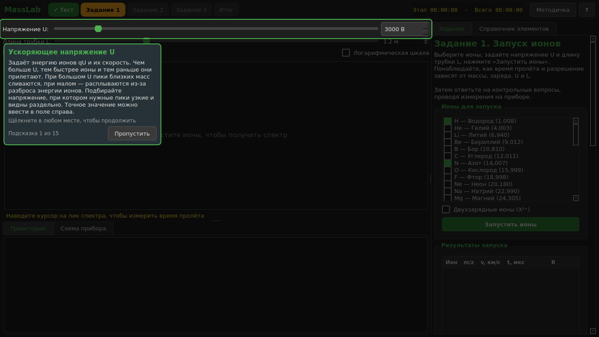 | **Тур-подсказки.** При первом входе в задание экран затемняется, подсвечивается очередной элемент, щелчок — следующая подсказка. Повтор — кнопка «?». |
| 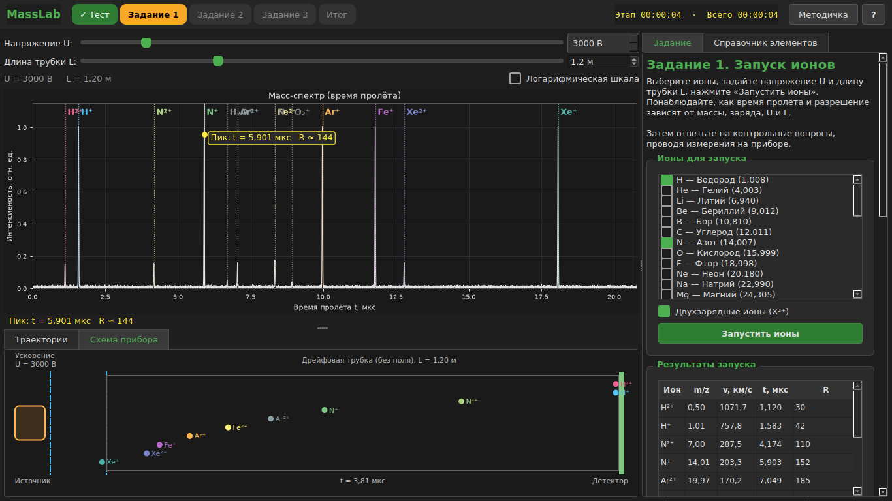 | **Задание 1.** Выбор ионов, двухзарядные ионы, напряжение U, длина трубки L. Таблица: m/z, v, t, R. Пять контрольных вопросов на измерения; верные ответы фиксируются, неверные заменяются. |
| 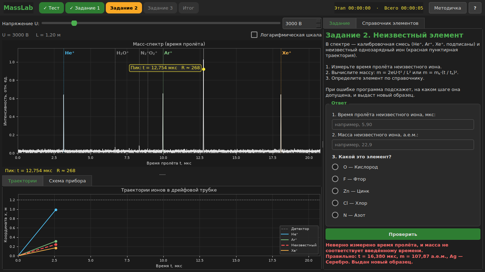 | **Задание 2.** Калибранты He⁺, Ar⁺, Xe⁺ и неизвестный ион. Студент вводит измеренное время, вычисленную массу и выбирает элемент. Программа сообщает, на каком шаге ошибка. |
| 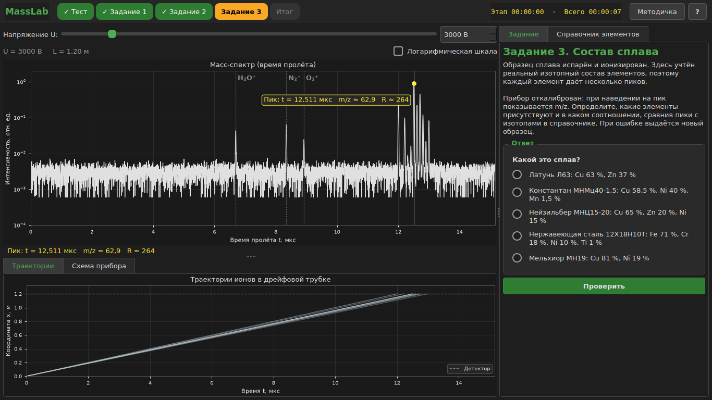 | **Задание 3.** Спектр сплава с реальным изотопным составом; прибор показывает m/z. Выбор из 5 сплавов, варианты подбираются с общими элементами. |
| 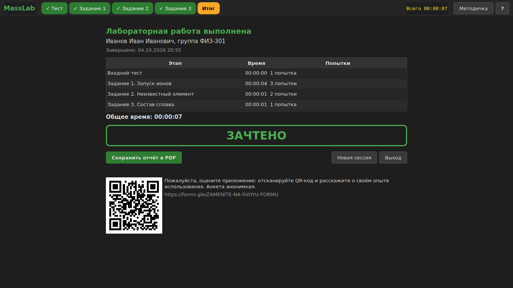 | **Итог.** Время этапов и попытки, «ЗАЧТЕНО», сохранение PDF, QR-код анкеты. |
| 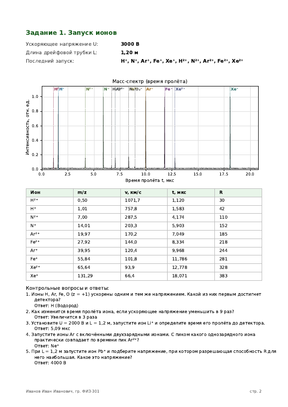 | **PDF-отчёт.** Титульная страница со сводкой и по странице на задание: условия измерений, исследованный спектр, таблица данных, контрольные вопросы с ответами. |
| 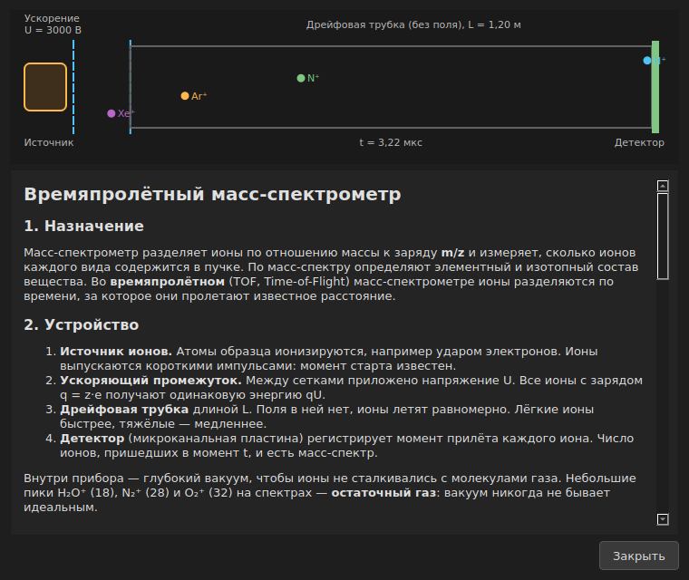 | **Методичка.** Анимированная схема прибора, формулы, пример расчёта, разрешение и выбор напряжения. |
| 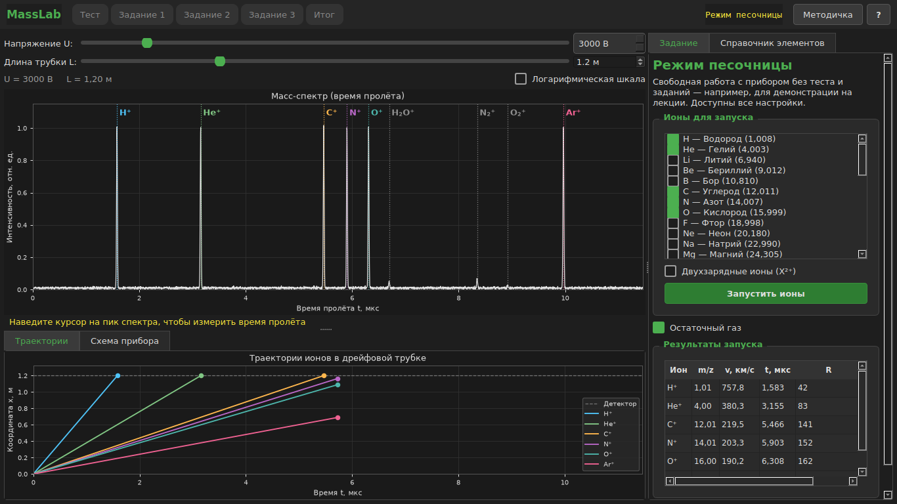 | **Песочница.** Прибор со всеми настройками без теста и заданий — для демонстрации на лекции. |

Общее правило заданий: неверный ответ заменяется новым (вопрос или образец),
чтобы ответ нельзя было подобрать перебором. После двух ошибок подряд
появляются пошаговые подсказки.

---

## 3. Физическая модель

**Время пролёта.** Ион с зарядом q = z·e, ускоренный напряжением U:
qU = mv²/2, &nbsp; t = L·√(m / 2qU). Масса по времени: m = 2eU·t²/L²;
калибровка: m = m_к·(t/t_к)².

**Ширина пика** складывается из двух независимых вкладов:

σ² = σ_д² + (t·ΔE / 2qU)²

- σ_д = 8 нс — временное разрешение детектора (МКП);
- ΔE = 2 эВ — разброс начальной энергии ионов.

**Разрешающая способность** R = m/Δm = t / (2·FWHM). При большом U пики
стоят тесно (Δt ∝ 1/√U) и ограничены детектором; при малом — расплываются из-за
ΔE. Поэтому есть **оптимальное напряжение**, растущее с массой:

| Ион | 500 В | 1 кВ | 2 кВ | 3 кВ | 4 кВ | 8 кВ | 20 кВ |
|---|---|---|---|---|---|---|---|
| N⁺ | 102 | 167 | **175** | 152 | 134 | 96 | 61 |
| Cu⁺ | 105 | 199 | 294 | **296** | 273 | 203 | 129 |
| Pb⁺ | 106 | 208 | 368 | 438 | **445** | 361 | 233 |

Изотопы свинца (204–208) разделяются при 2–6 кВ и сливаются при 500 В – 1 кВ
и 12–20 кВ — это студент видит сам. Более длинная трубка повышает R, но не
выше предела U/(2,355·ΔE), заданного разбросом энергии (мотивация рефлектрона).

**Дополнительно:** двухзарядные ионы (X²⁺ прилетает вместе с ионом массы m/2),
изотопный состав 13 элементов, остаточный газ (H₂O⁺, N₂⁺, O₂⁺), шум детектора.

**Поиск пиков** имитирует обработку на приборе: адаптивное сглаживание (окно
≈ σ в каждой точке), объединение максимумов без провала ≥ 25 % — неразрешённые
пики сливаются, FWHM измеряется по данным.

---

## 4. Архитектура: MVP с пассивным видом

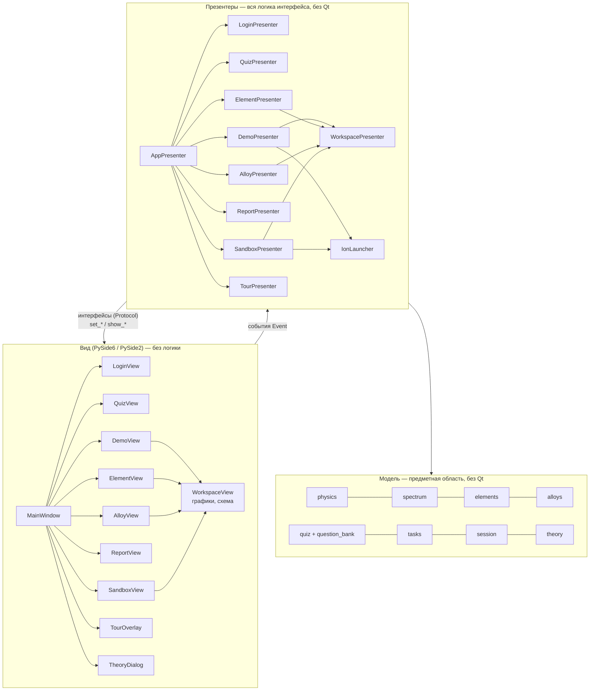

**Пассивный вид.** Виды только сообщают о действиях пользователя через
события (`Event`, без зависимости от Qt) и показывают готовые данные
(`PlotData`, `SchemeData`, `QuestionItem`, `ReportData`). Решения принимают
презентеры, которые знают виды только через интерфейсы
`views/interfaces.py` (`typing.Protocol`). Поэтому презентеры полностью
тестируются с поддельными видами (`tests/fakes.py`), без запуска Qt.

Пример взаимодействия — проверка ответа в задании 2:

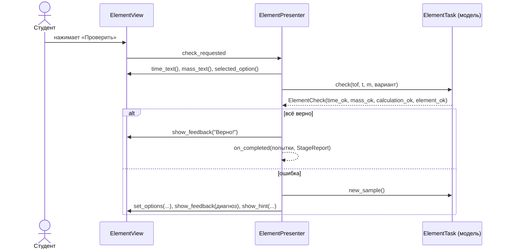

### Структура исходного кода

```
main.py                         точка входа
masslab/
  config.py                     ссылка на анкету, хэш пароля песочницы
  events.py                     Event — события видов
  report_pdf.py                 PDF-отчёт (matplotlib)
  model/                        physics, spectrum, elements, alloys, quiz,
                                question_bank, tasks, session, theory
  presenters/                   app, login, quiz, demo, element, alloy, report,
                                sandbox, tour, workspace, launcher, hints, formatting
  views/
    interfaces.py, viewmodels.py
    qt/                         qt.py (PySide6/PySide2), main_window, pages,
                                task_views, workspace_view, plot_widget,
                                scheme_widget, tour_overlay, widgets, style
tests/                          175 тестов
```

---

## 5. Качество и тестирование

- **175 автоматических тестов** (pytest), проходят на двух стеках:
  Python 3.11 + PySide6 и Python 3.8 + PySide2.
- Модель: физика (оптимум U, влияние L, m/z), спектры (разрешение изотопов
  Cu и Pb, устойчивость к шуму), формат всех вопросов банка, задания, сессия.
- Презентеры: весь сценарий от входа до отчёта, тур, песочница, диагностика
  ошибок, подсказки, экспорт PDF (в т. ч. ошибка записи) — с поддельными видами.
- Qt-виды: соответствие интерфейсам, наличие всех целей тура, прохождение
  приложения в реальном окне 1024×768, генерация PDF.

---

## 6. Конфиденциальность

- Ни результаты, ни ФИО не записываются на диск; каждый запуск — новая сессия.
- PDF создаётся только по кнопке студента, в выбранном им месте.
- Банк вопросов собран внутрь exe.
- Пароль песочницы хранится как SHA-256-хэш; в исходниках и тестах его нет.

---

## 7. Настройка и сопровождение

| Что | Где |
|---|---|
| Добавить вопросы теста | `masslab/model/question_bank.py` (формат описан в файле) |
| Ссылка на Google-форму | `masslab/config.py` → `FEEDBACK_FORM_URL` |
| Пароль песочницы | `masslab/config.py` → `SANDBOX_PASSWORD_SHA256` (команда для хэша — в файле) |
| Параметры прибора | `masslab/model/physics.py` (ΔE, σ детектора, диапазоны U и L) |
| Сплавы | `masslab/model/alloys.py` |
| Тексты подсказок тура | `masslab/presenters/tour.py` |
| Методичка | `masslab/model/theory.py` |

**Сборка exe** (Windows, Python 3.8): `build_exe.bat` или вручную запускаемый
workflow GitHub Actions «Build Windows exe». Результат — папка `dist\MassLab`,
которая копируется на флешку и запускается на любом компьютере класса.

---

## 8. Планы

- Режим с рефлектроном (компенсация разброса энергий, рост R).
- Газовые смеси и молекулярные осколки.
- Проверка на компьютерах класса под Windows 7.
